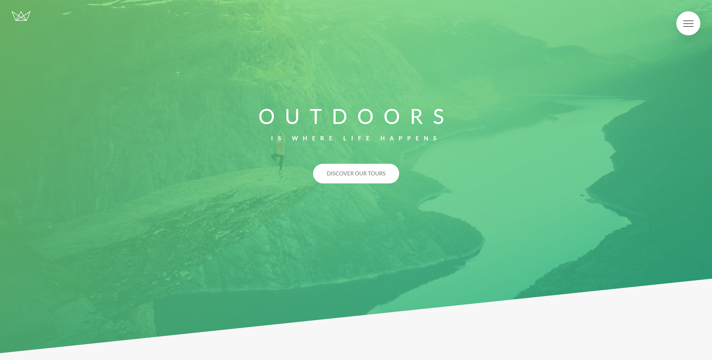
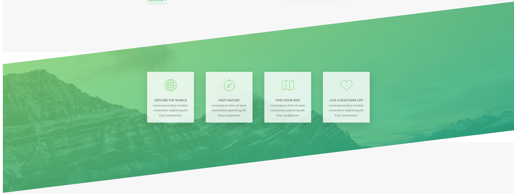
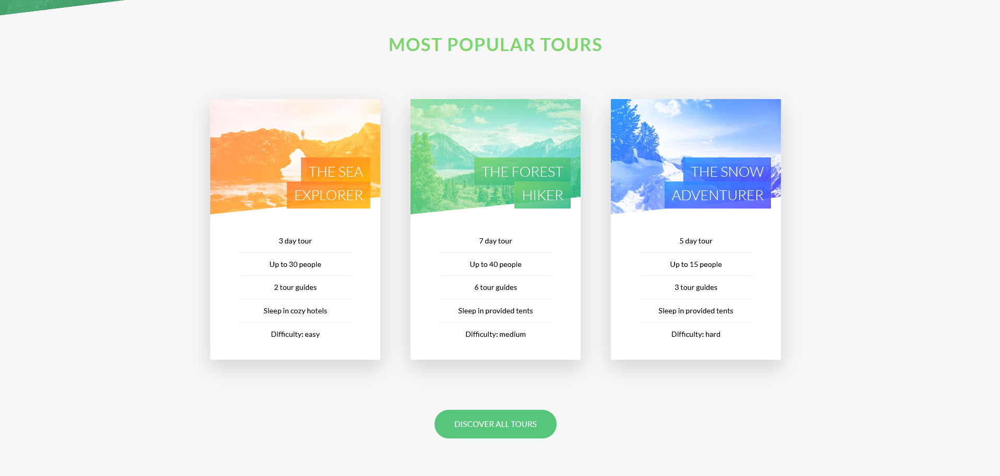
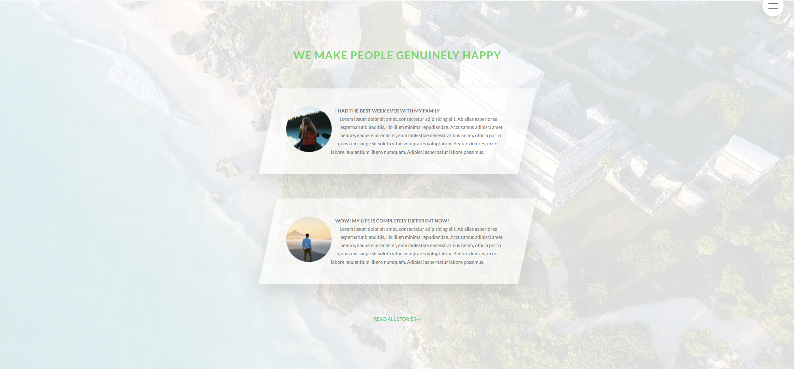
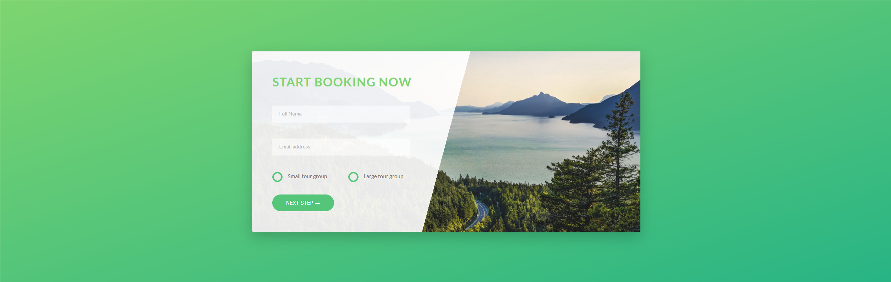

# advanced-css

# Natours Project 🏞️

This project was part of Jonas Schmedtmann's Advances CSS & SASS course on Udemy.

The goal of this repo is to practice the following skill sets:

- CSS
  - **Animations**: primary objective of this project
    - `transition` & `transform`
    - `hovering effects`
    - `clip-path`
    - `skew properties`

## Links

[Live Demo](https://nature-frenzy017.netlify.app/)

## Screenshots

> Normal View / Desktop Layout

## Helpful information on CSS to use for future reference

Three pillars to write good html and css

**Responsive design**

* Fluid layouts
* Media queries
* Responsive images
* Desktop-first vs mobile-first

**Maintainable and scalable code**

* Clean
* Easy-to-understand
* Growth
* Reusable
* How to organize files
* How to name classes
* How to structure HTML

**Web performance**

* Less HTTP requests
* Less code
* Compress code
* Use a CSS preprocessor
* Less images
* Compress mages

**What happens to CSS when we load up a webpage?**

*Loads HTML > Parse HTML > Load CSS > Parse CSS > Create
DOM / CSS Object model > Renders the tree > Website rendering the visual formatting model > Final rendered Site*

**The Cascade (The "C" in CSS)**
*- Process of combining different stylesheets and resolving conflicts
between different CSS rules and declarations, when more than one
rule applies to a certain element.*

**How CSS is parsed & specificity**

*Importance > Specificity > Source Order*

// Importance

1. User :important declarations
2. Author :important declarations
3. Author declarations
4. User declarations
5. Default browser declarations

// Specificity

1. Inline styles
2. IDs
3. Classes, pseudo-classes, attribute
4. Elements, pseudo-elements

// Source order
// Same specificity?
*The last declaration in the code will override all other
declarations and will be applied*

* Css declarations marked with !important have the highest priority
* But, only use !important as a last resource. It's better to use correct
  specificities - more maintainable code!
* inline styles will always have priority over styles in external stylesheets
* A selector that contains 1 ID is more specific than one with 100 classes
* A selector that contains 1 class is more specific than one with 1000 elements
* The universal selector has no specificity value(0,0,0,0)
* Rely more on specificity than on the order of selectors

**How units are converted from relative to absolute (PX)**

* %(fonts) - x% * parent's computed font-size
* %(lengths) - x% * parent's computed width
* em(font) - x * parent computed font size
* em(length hs) - x * current element computed font-size
* rem - x * root computed font-size
* vh - x * 1% of viewport height
* vw - x * 1% of viewport width

**Inheritance: what you need to know**

* Inheritance passes the values for some specific properties
  from parents to children - more maintainable code.
* Properties related to text are inherited: font-family, font-size, color etc.
* The computed value of a property is what gets inherited, not the declared value
* Inheritance of a property only works if no one declares a value for that property
* The inherit keyword forces inheritance on a certain property

**The Box Model**

* Content: text, images, etc
* Padding: transparent area around the content, inside of the box
* Border: goes around the padding and the content
* Margin: space between boxes
* Fill area: area that gets filled with background color or background image

**The Box Model: Heights and Widths**

* total width: right border + right padding + specified width + left padding + left border
* total height: top border + top padding + specified height + bottom padding + bottom border
* Example: height = 0 + 20px + 100px + 20px + 0 = 140px

**Border-box**

* It only calculates specified width and specified height, nothing else

**Block-level-boxes**

* Elements formatted visually as blocks
* 100% of parent's width
* Vertically, one after another
* Box-model applies as showed
* Example : display: block, list-item, table

**Inline-boxes**

* Content is distributed in lines
* Occupies only content's space
* No line-breaks
* No heights and widths
* Paddings and margins only horizontal (left and right)
* Example: display: inline

**Inline-block-boxes**

* A mix of block and inline
* Occupies only content's space
* No line-breaks
* Box-model applies as showed
* Example: display: inline-block

**Positioning schemes: Normal flow, Absolute positioning, Floats**

**Normal flow**

* Default positioning scheme
* **Not** floated
* **Not** absolutely positioned
* Elements laid out according to their source order
* Example:  position: relative

**Floats**

* **Element is removed from the normal flow**
* Text and inline elements will wrap around the floated element
* The container will not adjust its height to the element
* Example: float: right, left

**Absolute positioning**

* Element is removed from the normal flow
* No impact on surrounding content or elements
* We use top, bottom, left and right to offset the element from its
  relatively positioned container
* Example: position: absolute, fixed

**Thinking about the layout**

**_Component-driven design_**

* Modular building blocks that make up interfaces
* Held together by the layout of the page
* Re-usable across a project, and between different projects
* Independent, allowing us to use them anywhere on the page

**Building with meaningful class names**

**_BEM (Block Element Modifier)_**

* **BLOCK**: standalone component that is meaningful on its own
* **ELEMENT**: part of a block that has no standalone meaning.
* **Modifier**: a different version of a block or an element.

**Architecting with files and folders**

**_The 7-1 pattern_**

* 7 different folders for partial Sass files, and
  1 main Sass file to import all other files into
  a compiled CSS stylesheet.
* Example: 
The 7 Folders: base/, components/ , layout/, pages/
themes/, abstracts/, vendors/

**How to start a project with Sass**

* CD into main directory
* Run npm init
* Run npm install node-sass
* mkdir sass
* CD sass/
* touch main.scss
* delete the default test script and type: "compile:sass": "node-sass sass/main.scss (instance path) css/style.css (output path)"